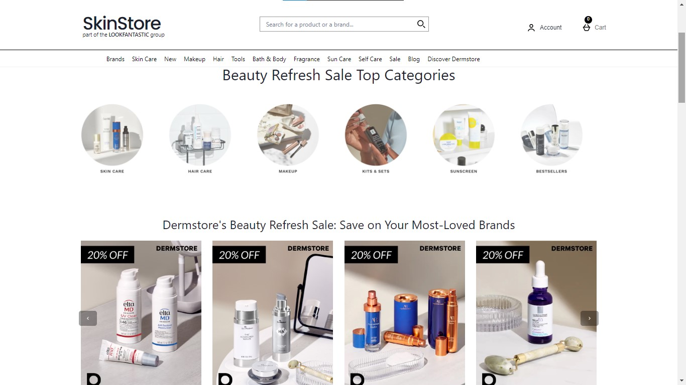
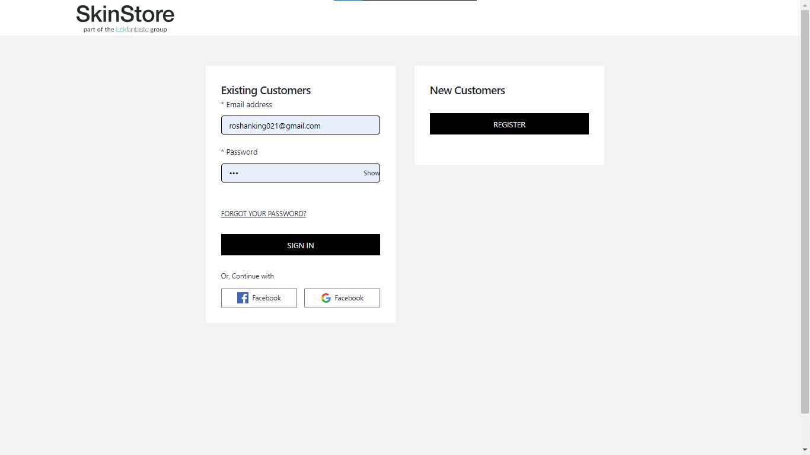
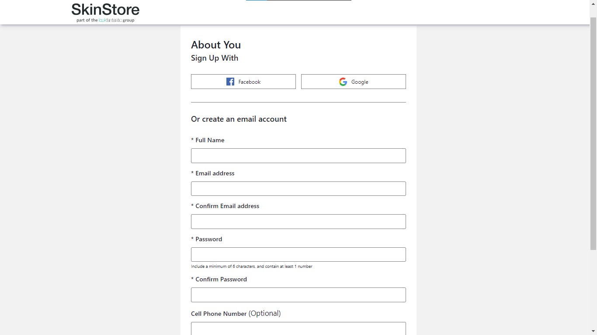
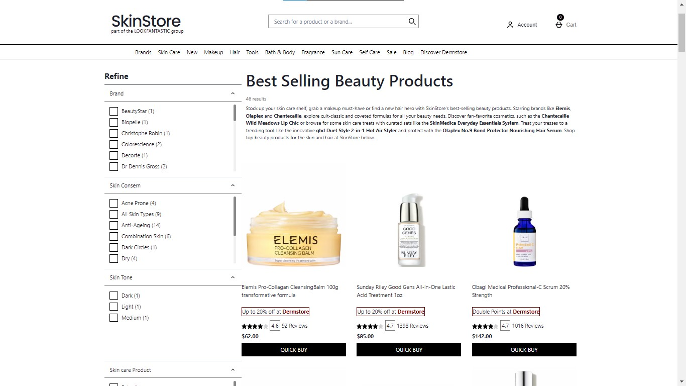
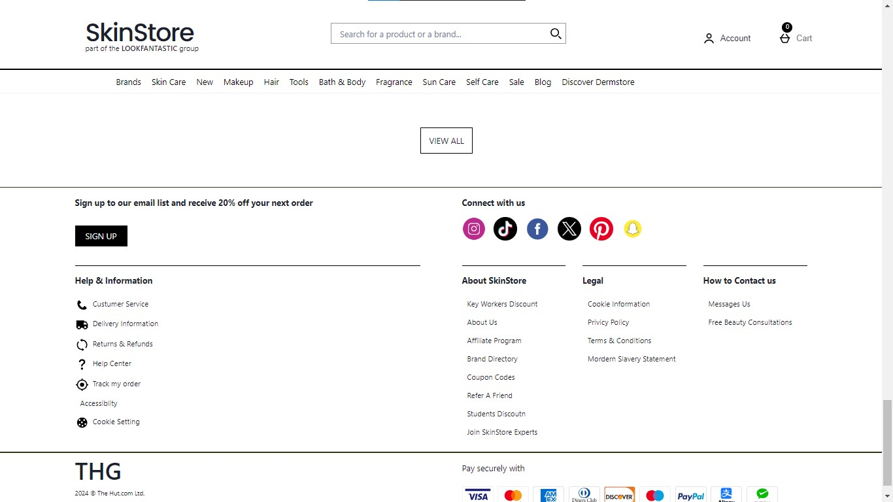

# www.skinstore.com clone

## About the Website

This a clone website of a US based Cosmetic Product Selling Website built with this tools like REACT JS, Chakra UI. Layout trys to match the original website and along with some features like login , logout. Take a look to this amazing ui **[https://skinstore-page.netlify.app/](https://skinstore-page.netlify.app/)**

## Installation

1. Clone the repository: `git clone [https://github.com/Roshanbhagat021/SkinStore-app.git]`
2. Install dependencies: `npm install`
3. Start the server: `npm run dev`

## Dependencies
- chakra-ui: 2.8.2
- react: 18.2.0
- react-dom: 18.2.0
- react-router-dom: 6.22.2
- react-slick: 0.30.2
- slick-carousel: 1.8.

## Features

#### Sleek UI

- A Beautiful and <mark>Good Looking UI</mark>

#### User Authentication

- <mark>Register</mark> , <mark>Login</mark> and <mark>Logout</mark> feature

#### ALL Products Page

- <mark>Product only page</mark> where use can choose from a lager category of products

#### Dynamic Links (with the help of router)

- For every page like: Register, Login, All Products page are using Dynamic links when ever user clicks on any of those links it takes to that page without refreshing the page with increases the proformence and user experience

## HOME PAGE

## HIGHLIGHTED PRODUCTS

## LOGIN PAGE

## REGISTER PAGE

## BEST SELLING PRODUCTS PAGE

## FOOTER

# Link For the Website: **[https://skinstore-page.netlify.app/](https://skinstore-page.netlify.app/)**

Always open for your feedbacks email: [roshanbhagatwork@gmail.com]()

